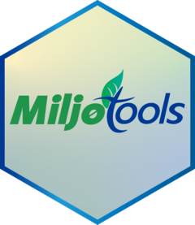

# miljotools 

This R package aims to host a variety of functions for and from [NIBIO DMN](https://www.nibio.no/en/about-eng/our-divisions/division-of-environment-and-natural-resources?locationfilter=true), departments [Soil](https://www.nibio.no/en/about-eng/our-divisions/division-of-environment-and-natural-resources/soil-and-land-use?locationfilter=true) and [Water](https://www.nibio.no/en/about-eng/our-divisions/division-of-environment-and-natural-resources/hydrology-and-water-environment?locationfilter=true). If any bugs or problems are encountered, please open a new [issue](https://github.com/moritzshore/miljotools/issues) and we will attempt to resolve it.

**Table of contents**

1.  [Installing miljotools](#install)

2.  [Tools](#start)

3.  [Add your own](#add)

4.  [Acknowledgements](#ack)

## Installing `miljotools` <a name="install"></a>

You can install and load `miljotools` from the GitHub repository using the following command:

``` r
# install remotes, if not already present
install.packages("remotes")

remotes::install_github(repo = "moritzshore/miljotools", ref = remotes::github_release())

library(miljotools)
```

## Tools <a name="start"></a>

View the "Articles" to get started

1.  [MET Nordic Reanalysis Dataset](https://moritzshore.github.io/miljotools/articles/metno_reanal.html)

2.  [Soil Classification](https://moritzshore.github.io/miljotools/articles/Norwegian_Soil_Classification.html)

3.  Coming soon..

## Add your own <a name="add"></a>

If you have a function / code / workflow / script / etc. which you would like to add to this package, please contact the maintainer for developer access.

## Acknowledgements <a name="ack"></a>

The development of this package was supported by the [NIBIO Environmental Modelling and Measures group](https://www.nibio.no/en/subjects/environment/environmental-modelling-and-measures?locationfilter=true), under the [Support Tools](https://www.nibio.no/en/subjects/environment/environmental-modelling-and-measures/support-tools?locationfilter=true) designation.

Additionally, this package was in part developed for the [OPTAIN](https://optain.eu/) project and has received funding from the European Union's Horizon 2020 research and innovation program under grant agreement No. 862756.

Finally, the logo is heavily inspired (celebrating) the old  logo


