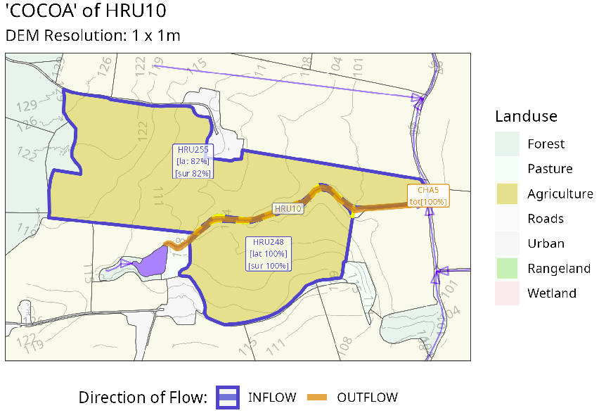
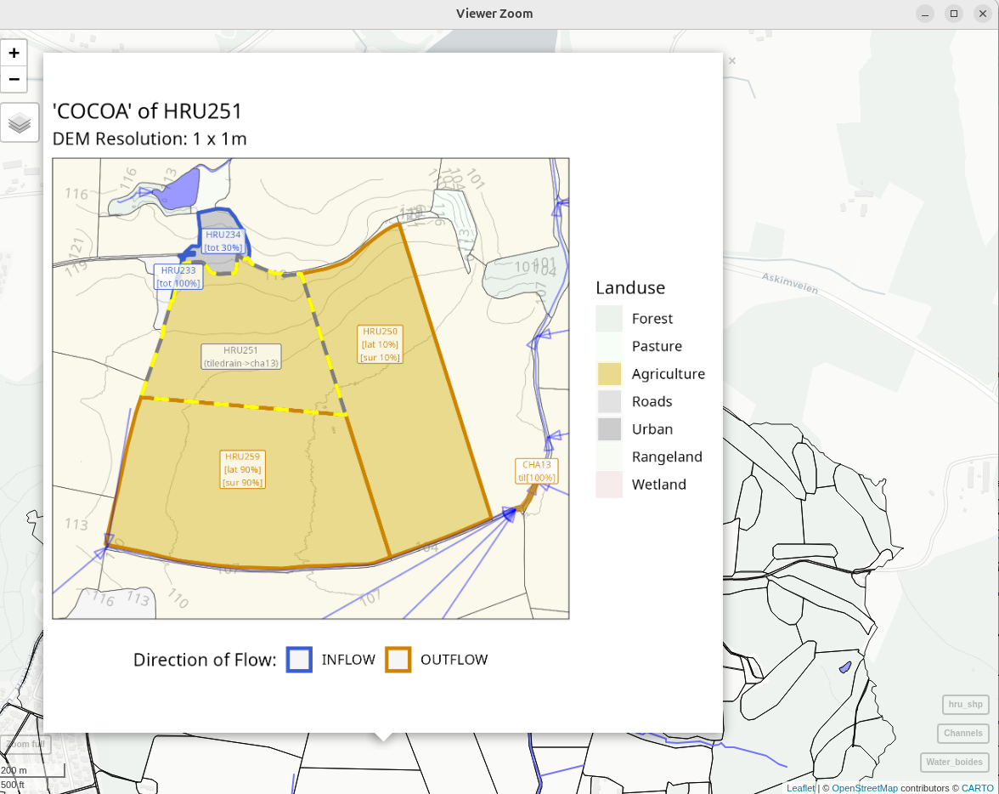

# Visualize COCOA

## Visualize COCOA

**Author**: Moritz Shore (<moritz.shore@nibio.no>)

**Date**: March, 2026

This tool allows you to visualize the Contiguous Object Connectivity
Approach (COCOA) of `SWATbuildR` and the OPTAIN project, which you can
read more about here:

> <https://www.optain.eu/sites/default/files/delivrables/OPTAIN%20D4.2%20-%20Modelling_Protocols.pdf>

The tool is simple to use if you have the prerequisites:

1.  A SWAT+ project created using
    [SWATbuildR](https://github.com/chrisschuerz/SWATbuildR)
2.  the ‘`land_connections_as_lines.shp`’ file generated by [this
    code](https://github.com/MR-Eini/Mini_setup_CREATE/blob/main/1_Setup/Libraries/create_connectivity_line_shape.R)

Please see the documentation of the function(s) for further details and
notes.

``` r
require(miljotools)
cocoa_hru(
  hru_id = 10,
  buildR_dir = "../SWAT-skuterud/project_data/SWATbuildR/skuterud_buildR/",
  agri_pattern = "a_",
  directory = "../SWAT-skuterud/project_data/figures/connectivity",
  save_to_png = F,
  verbose = T
)
```

Which would get you a plot that looks something like this:



You can also interactively plot ALL HRUs using the following function:

``` r
cocoa_vis(
  buildR_dir = "../SWAT-skuterud/project_data/SWATbuildR/skuterud_buildR/",
  RERENDER = TRUE,
  directory = "../SWAT-skuterud/project_data/figures/connectivity",
  verbose = TRUE
)
```

This can take quite a while, therefore the `RERENDER` flag exists, thus
you only need to render all the plots once, and can generate the
interactive map without re-rendering (`RERENDER = FALSE)`. This can give
you an interactive map which can look somewhat like this:



The function can be improved in the following way:

1.  Expand the land use legend
2.  Incorporated connectivity of water objects
3.  Faster plotting?
4.  …
