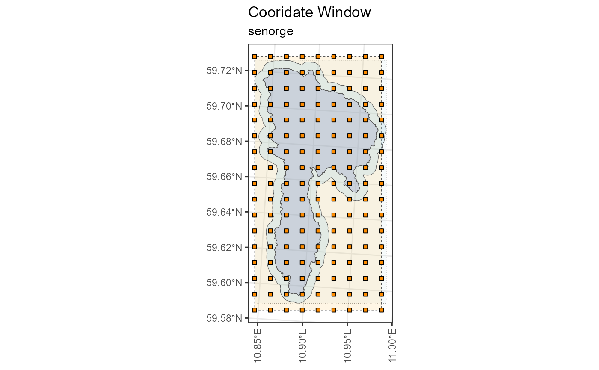
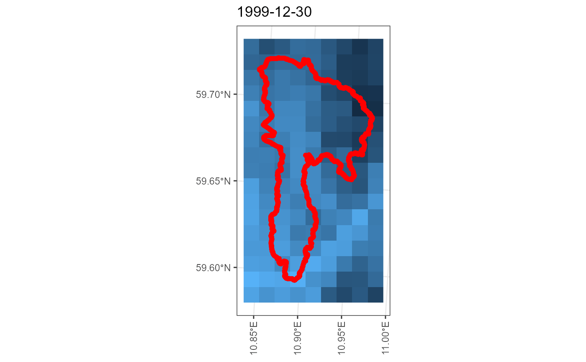
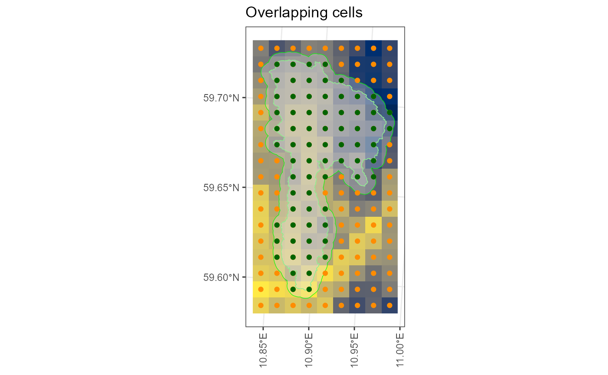

# Accessing the SeNorge2018 dataset

**Author**: Moritz Shore

**Date**: October, 2025

## Introduction

SeNorge2018 is a gridded (daily, 1x1km) dataset for Norway with
temperature and precipitation stretching from 1957 to present day.

Here are some useful links:

- [Documentation on
  GitHub](https://github.com/metno/seNorge_docs/wiki/seNorge_2018)

- [Data on the MET NO Thredds
  server](https://thredds.met.no/thredds/catalog/senorge/catalog.html)

- [Interactive website (senorge.no)](https://www.senorge.no/)

`miljotools` helps you access this dataset by allowing you to download
and apply a subset of the data that interests you. You can do this by:

1.  Determining your coordinate window
2.  Building your download query
3.  Downloading your queries
4.  Extracting data in “.csv” format.
5.  Apply data to models

## Flowchart


A useful flowchart on how the miljotools SeNorge functions fit together

## Workflow

``` r
require(miljotools)
require(sf)
require(mapview)
```

We need to provide a shapefile (polygon) of our desired area to
download. In this example we will download the following publicly
available watershed file:

``` r
download.file(url = "https://gitlab.nibio.no/moritzshore/example-files/-/raw/main/MetNoReanalysisV3/cs10_basin.zip", destfile = "cs10_basin.zip")
unzip("cs10_basin.zip")
cs10_basin = "cs10_basin/cs10_basin.shp"
example_polygon_geometry <- read_sf(cs10_basin)
map1 <- mapview(example_polygon_geometry, alpha.regions = .3, legend = F)
map1
```

We can use the same function as for the MET Nordic dataset for SeNorge,
we just need to adjust the “project” parameter. We will also buffer the
shapefile by 500 m to include grid cells just outside the boundaries.

``` r
my_coord_window <- metnordic_coordwindow(
  area_path = example_polygon_geometry,
  area_buffer = 500,
  source = "senorge",
  verbose = TRUE, 
  interactive = FALSE
)
```

    ## miljo🌿tools > metnordic_coordwindow  >> getting base file from: SeNorge2018
    ## miljo🌿tools > metnordic_coordwindow  >> basefile downloaded. 
    ## miljo🌿tools > metnordic_coordwindow  >> Loading and projecting shapefile... 
    ## miljo🌿tools > metnordic_coordwindow  >> geometry detected: sfc_POLYGON
    ## miljo🌿tools > metnordic_coordwindow  >> buffering shapefile:  500 m
    ## miljo🌿tools > metnordic_coordwindow  >> calculating coordinate window... 
    ## miljo🌿tools > metnordic_coordwindow  >> coordinate window is: xmin=341 xmax=349 xmin=1388 ymax=1372



Now we can use this coordinate window to build our download queries. At
this stage we need to define which variables we should like to download,
at which resolution, and for which time period. In this example we are
downloading all the variables (`tg` = mean daily temperature, `tn` =
minimum daily temperature, `tx` = maximum daily temperature, `rr` =
total daily precipitation), from a random day in 1999 to a random day in
2001. We are doing this at a grid resolution of 1x1.

``` r
my_queries <- senorge_buildquery(
  bounding_coords = my_coord_window,
  variables = c("tg", "tn", "tx", "rr"),
  fromdate = "1999-12-30",
  todate = "2000-01-02",
  grid_resolution = 1,
  verbose = TRUE
)
```

    ## miljo🌿tools > senorge_buildquery  >> You have a grid of: 8 x 16 (128 cells)
    ## miljo🌿tools > senorge_buildquery  >> generating urls with a grid resolution of: 1 x 1 km
    ## miljo🌿tools > senorge_buildquery  >> Returning queries.. (2)

Now that we have our queries, we can download our customized files. We
can provide our polygon to double check that the download matches the
area we want.

``` r
my_download <- senorge_download(
  queries = my_queries,
  directory = "senorge_download",
  variables =  c("tg", "tn", "tx", "rr"),
  polygon = example_polygon_geometry,
  verbose = FALSE
)
```



Diagnostic plots

With our files downloaded in `.nc` format, we can convert them to `.csv`
for the grid cells that cover our desired area. (Note: at this stage you
can use a different, smaller polgyon if you only want to extract a
smaller subset of the available data)

``` r
senorge_extract_grid(
  directory = my_download,
  outdir = "senorge_extract_grid",
  area = example_polygon_geometry,
  variables = c("tg", "tn", "tx", "rr"),
  buffer = 500,
  verbose = FALSE,
  map = TRUE
) -> my_extract
```



Having a look at the results:

``` r
list.files(my_extract, pattern = ".csv", full.names = T)[1] %>% readr::read_csv(show_col_types = FALSE)
```

    ## # A tibble: 4 × 6
    ##   vstation date          tg     tn    tx    rr
    ##      <dbl> <date>     <dbl>  <dbl> <dbl> <dbl>
    ## 1        1 1999-12-30 -5.59 -10.7  -4.42  0   
    ## 2        1 1999-12-31 -9.61 -13.5  -8.46  0   
    ## 3        1 2000-01-01 -9.35  -9.35 -2.75 10.3 
    ## 4        1 2000-01-02 -5.45  -6.39  3.16  0.47

``` r
metadata_path = list.files(my_extract, pattern = ".shp", full.names = T)
metadata_path %>% sf::read_sf() %>% mapview::mapview(label = "vstation", legend = FALSE)
```

## Model Connections

If you are using [SWAT+](https://swat.tamu.edu/software/plus/) you can
apply the SeNorge data to your setup using the following function:

``` r
swatplus_senorge(
  extract_path = my_extract,
  metadata = metadata_path,
  DEM = "../../swat-cs10/model_data/input/elevation/cs10_dem_1m_utm33n.tif",
  aux_data = "../../swat-cs10/model_data/input/met/cs10_weather_data.xlsx",
  epsg_code = 25832,
  write_path = "../../mt-testing/MetNord_MN2/",
  verbose = FALSE
)
```
