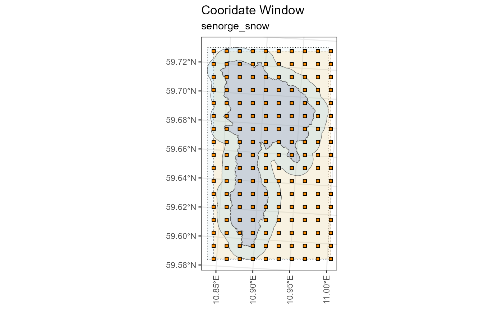
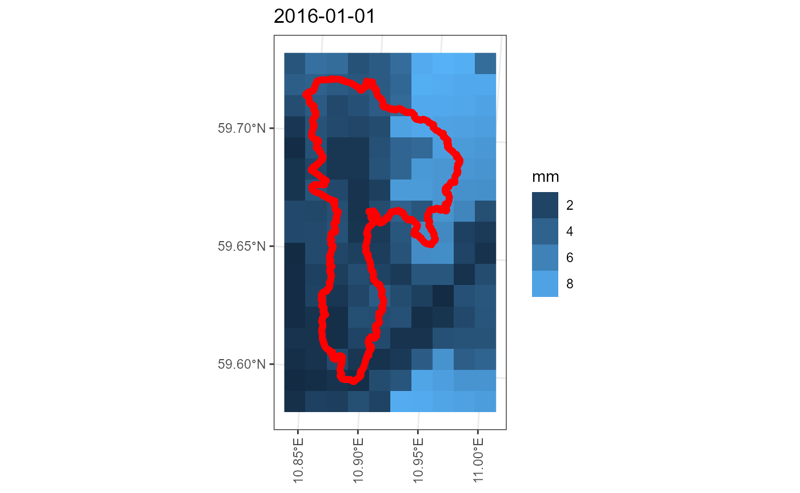
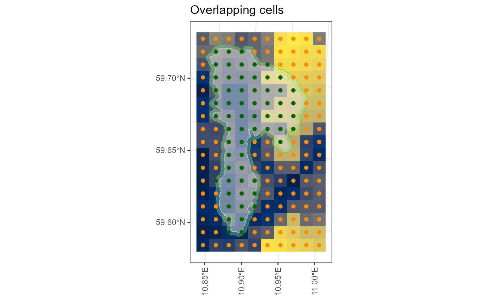
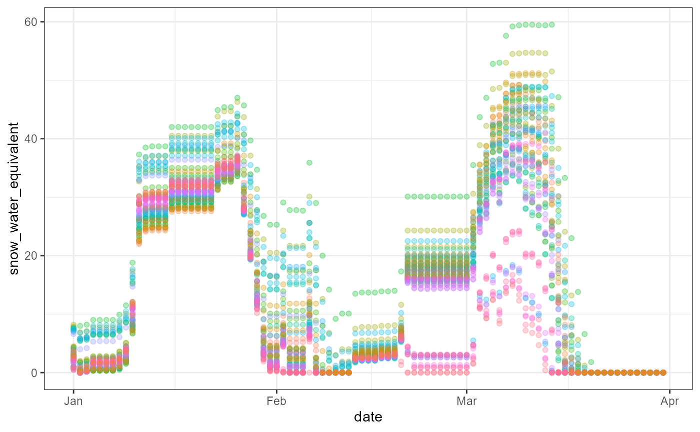

# Accessing the SeNorge Snow dataset

**Author**: Moritz Shore (<moritz.shore@nibio.no>)

**Date**: May, 2026

## Introduction

The SeNorge snow dataset is described here:

> <https://github.com/metno/seNorge_docs/wiki/seNorge_snow>

`miljotools` can access this data using the [same functions as for the
“SeNorge2018”
data](https://moritzshore.github.io/miljotools/articles/senorge.html).

What follows is a working script on how to access this dataset for a
specific shapefile:

Loading Libraries:

``` r

require(miljotools)
require(sf)
require(mapview)
require(dplyr)
require(tibble)
```

Downloading the example catchment:

``` r

download.file(url = "https://gitlab.nibio.no/moritzshore/example-files/-/raw/main/MetNoReanalysisV3/cs10_basin.zip", destfile = "cs10_basin.zip")
unzip("cs10_basin.zip")
cs10_basin = "cs10_basin/cs10_basin.shp"
example_polygon_geometry <- read_sf(cs10_basin)
map1 <- mapview(example_polygon_geometry, alpha.regions = .3, legend = F)
map1
```

Defining coordinate window:

> *Note, the source is “senorge_snow”!*

``` r

metnordic_coordwindow(
  area_path = cs10_basin,
  area_buffer = 1000,
  source = "senorge_snow",
  verbose = T,
  interactive = F
) -> cw
```

    ## miljo🌿tools > metnordic_coordwindow  >> getting base file from: SeNorge_snow
    ## miljo🌿tools > metnordic_coordwindow  >> basefile downloaded. 
    ## miljo🌿tools > metnordic_coordwindow  >> Loading and projecting shapefile... 
    ## miljo🌿tools > metnordic_coordwindow  >> geometry detected: sfc_POLYGON
    ## miljo🌿tools > metnordic_coordwindow  >> buffering shapefile:  1000 m
    ## miljo🌿tools > metnordic_coordwindow  >> calculating coordinate window... 
    ## miljo🌿tools > metnordic_coordwindow  >> coordinate window is: xmin=341 xmax=350 xmin=163 ymax=179



Choosing a variable:

``` r

senorge_snow_var = "swe"
```

> *SeNorge Snow uses different names for variables depending on whether
> they are stored in the file name, or within the ncdf4 file itself.
> This is quite annoying and requires a recoding of the variable name,
> which can be done using the code below:*

``` r

senorge_snow_variables <- c("fsw", "lwc", "qsw", "qtt", "sd", "sdfsw", "ski", "swe", "swepr")
senorge_snow_variable_inner <- c("snow_amount","snow_liquid_water_content","snow_melt",
                                   "runoff_amount","snow_depth","snow_depth", 
                                   "snow_condition","snow_water_equivalent",
                                   "snow_water_equivalent_percentage")
snow_recode <- tibble::tibble(outer = senorge_snow_variables, 
                              inner = senorge_snow_variable_inner)


inner_var <- dplyr::recode_values(x = senorge_snow_var,
                                  from = snow_recode$outer,
                                  to = snow_recode$inner)
inner_var
```

    ## [1] "snow_water_equivalent"

Building the download queries.

``` r

senorge_buildquery(
  bounding_coords = cw,
  variables = senorge_snow_var,
  fromdate = "2016-01-01",
  todate = "2016-12-31",
  grid_resolution = 1,
  verbose = T
) -> myq
```

    ## miljo🌿tools > senorge_snow_buildquery  >> You have a grid of: 9 x 16 (144 cells)
    ## miljo🌿tools > senorge_snow_buildquery  >> generating urls with a grid resolution of: 1 x 1 km
    ## miljo🌿tools > senorge_buildquery  >> Returning queries.. (1)

Downloading the queries:

> *Note the use of `inner_var` in this function!*

``` r

senorge_download(
  queries = myq,
  directory =  "senorge_snow_download",
  variables = inner_var,
  polygon =  cs10_basin,
  verbose = F
) -> dldir
```



``` r

senorge_extract_grid(
  directory = dldir,
  outdir = "senorge_snow_extract",
  area =  cs10_basin,
  variables = inner_var,
  buffer = 250,
  verbose = F,
  map = T
) -> edir
```



An example analysis using the extracted data:

``` r

require(vroom)
```

    ## Loading required package: vroom

``` r

require(ggplot2)
```

    ## Loading required package: ggplot2

``` r

list.files(edir, pattern = ".csv", full.names = T) %>% vroom::vroom(show_col_types = F, altrep = FALSE) -> data

data %>% filter(date < "2016-04-01") %>% ggplot() +
  aes(x = date, y = snow_water_equivalent, 
      color = vstation %>% as.factor()) +
  geom_point(alpha = .3) +
  theme_bw() +
  theme(legend.position = "none")
```


