# Thermopluviograms

**Author**: Moritz Shore (<moritz.shore@nibio.no>)

**Date**: 01.06.2022

## Introduction

This tutorial will show you how to create Thermopluviograms and Extreme
rainfall plots using climate data from the Norwegian climate service and
observed data from SeNorge. To get started, we will grab data from
SeNorge.

### SeNorge

1.  Go to [senorge.no](https://www.senorge.no/), from the side menu,
    select themes \> daily maps \> temperature

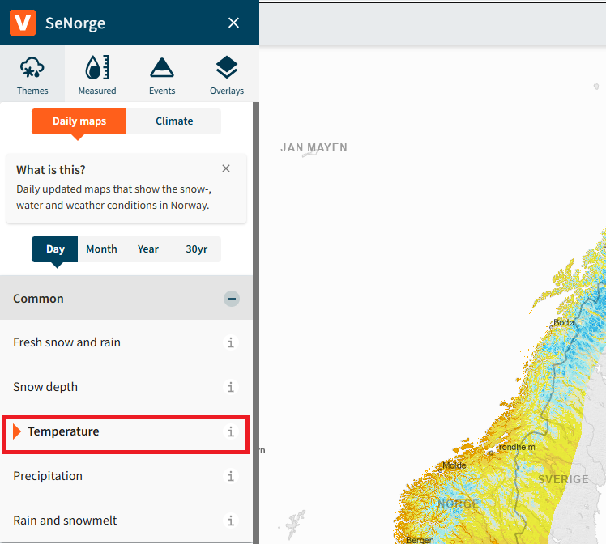

2.  Select the point on interest on the map, then select “Graph of the
    point” and then download data from the point

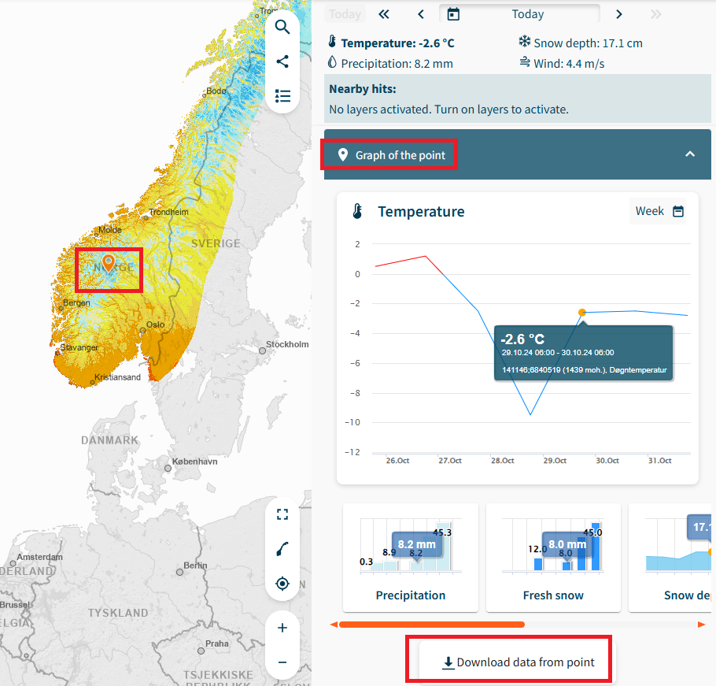

3.  Perform the same for Precipitation:

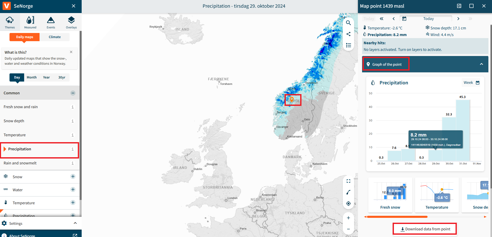

That concludes the data acquisition part from SeNorge. Of course, you
can source your observed data from where ever you please and use it in
stead of SeNorge, if you match the format.

### NVE

Our climate data will be sourced from NVE’s Klima service cente

1.  Go to <https://nedlasting.nve.no/klimadata/kss> (DEPRECATED)

2.  Nevermind, that has been discontinued, instead go here:
    <https://thredds.met.no/thredds/catalog/KSS/Klima_i_Norge_2100/utgave2015/catalog.html>

3.  It seems like getting this data has become a lot harder now, and
    perhaps needs a re-anylsis v3 type solutions.. for now the tutorial
    will continue with our example data, and it is up to you to manage
    the download for your location (for now).

## Workflow

For this example, we will download example data from a GitLab Repo:

``` r

download.file(url = "https://gitlab.nibio.no/moritzshore/example-files/-/raw/main/thermopluviograms/Climate_Data.zip", 
              destfile = "Climate_Data.zip")
unzip("Climate_Data.zip", 
      exdir = ".")
```

Now we can generate the Thermopluviograms

``` r

thermopluviogram(
  modelled_climate = "Climate_Data/Modelled/",
  observed_pr = "Climate_Data/Observed/senorge_pr.csv",
  observed_tm = "Climate_Data/Observed/senorge_temp.csv",
  outpath = "../man/figures",
  location = "Aas",
  chosen_model_runs = c("CNRM-CCLM", "CNRM-RCA", "ECEARTH-RCA", "IPSL-RCA"),
  ref_startdate = "1971-01-01",
  ref_enddate = "2005-12-31",
  obs_startdate = "2041-01-01",
  obs_enddate = "2070-12-31",
  left_yaxis_only = T,
  fixed_axis = T,
  verbose = T
)
#> miljo🌿tools >   >> Missing CRAN packages are required to run this function, installing now: ggrepel 
#> package 'ggrepel' successfully unpacked and MD5 sums checked
#> 
#> The downloaded binary packages are in
#>  C:\Users\mosh\AppData\Local\Temp\RtmpCyH3RG\downloaded_packages
#> miljo🌿tools > thermopluviogram  >> generating thermopluviograms... 
#> ...for period 2041-01-01 to 2070-12-31 
#> ...with a reference period from 2005-12-31 to 1971-01-01 
#> ...for location named Aas 
#> ...using modelled data from Climate_Data/Modelled/ 
#> ...and observed precipitation data from Climate_Data/Observed/senorge_pr.csv 
#> ...and observed temperature data from Climate_Data/Observed/senorge_temp.csv 
#> ...and generating for the experiments hist, rcp45, rcp85 
#> ...with an x axis range from 4.5 to 8.5 labelled: Mean Annual Temperature (°C) 
#> ...with a y axis range from  800 to 1100 and plotting only the leftmost label? TRUE 
#> ...using a font size of  7 
#> ...with a fixed axis? TRUE 
#> ...highlighting models: CNRM-CCLM, CNRM-RCA, ECEARTH-RCA, IPSL-RCA 
#> ...and generating files here ../man/figures
#> miljo🌿tools > thermopluviogram  >> importing data... 
#> miljo🌿tools > thermopluviogram  >> loading modelled data from  Climate_Data/Modelled/
#> miljo🌿tools > thermopluviogram  >> generating property matrix... 
#> miljo🌿tools > thermopluviogram  >> post-processing modelled climate 
#> miljo🌿tools > thermopluviogram  >> loading observed precipitation data from  Climate_Data/Observed/senorge_pr.csv
#> miljo🌿tools > thermopluviogram  >> loading observed temperature data from  Climate_Data/Observed/senorge_temp.csv
#> miljo🌿tools > thermopluviogram  >> post-processing observed data 
#> miljo🌿tools > thermopluviogram  >> merging observed and modelled data 
#> miljo🌿tools > thermopluviogram  >> calculating statisics... 
#> miljo🌿tools > thermopluviogram  >> generating plots... 
#> miljo🌿tools > thermopluviogram  >> generating thermopluviogram for experiment historical
#> miljo🌿tools > thermopluviogram  >> saving thermopluviogram  tpg_Aas_hist_71-05_41-70.png
#> ggrepel: 0.500000s elapsed for 88090 iterations, 16 overlaps. Consider increasing 'max.time'.
#> miljo🌿tools > thermopluviogram  >> generating exetreme rain plot for experiment  hist
#> miljo🌿tools > thermopluviogram  >> saving extreme rain plot xtreme_rain_Aas_hist_71-05_41-70.png
#> miljo🌿tools > thermopluviogram  >> generating thermopluviogram for experiment RCP 4.5
#> miljo🌿tools > thermopluviogram  >> saving thermopluviogram  tpg_Aas_rcp45_71-05_41-70.png
#> ggrepel: 0.500000s elapsed for 144390 iterations, 6 overlaps. Consider increasing 'max.time'.
#> miljo🌿tools > thermopluviogram  >> generating exetreme rain plot for experiment  rcp45
#> miljo🌿tools > thermopluviogram  >> saving extreme rain plot xtreme_rain_Aas_rcp45_71-05_41-70.png
#> miljo🌿tools > thermopluviogram  >> generating thermopluviogram for experiment RCP 8.5
#> miljo🌿tools > thermopluviogram  >> saving thermopluviogram  tpg_Aas_rcp85_71-05_41-70.png
#> ggrepel: 0.500000s elapsed for 136670 iterations, 7 overlaps. Consider increasing 'max.time'.
#> miljo🌿tools > thermopluviogram  >> generating exetreme rain plot for experiment  rcp85
#> miljo🌿tools > thermopluviogram  >> saving extreme rain plot xtreme_rain_Aas_rcp85_71-05_41-70.png
#> miljo🌿tools > thermopluviogram  >> plots have been saved to ../man/figures
#> [1] "../man/figures"
```

### Plots

``` r

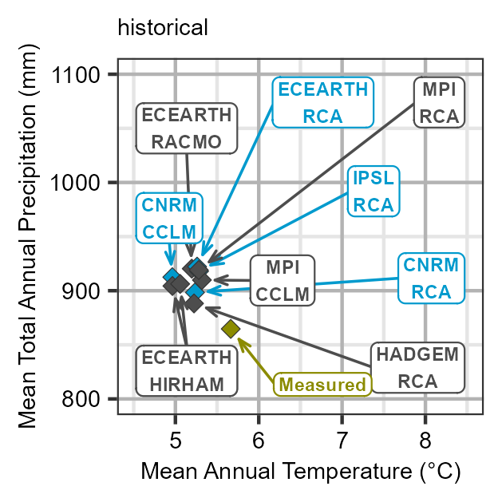
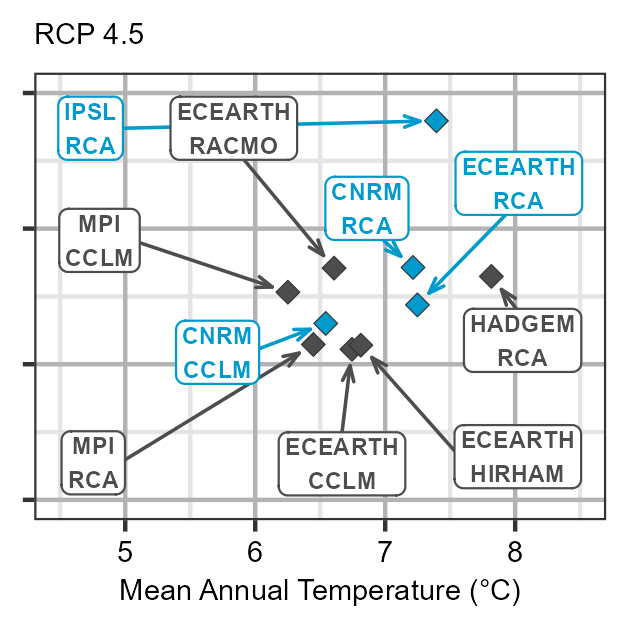
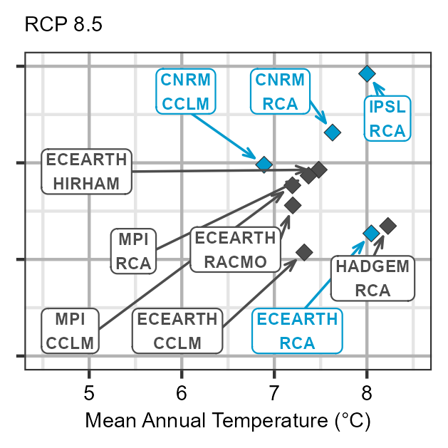
```

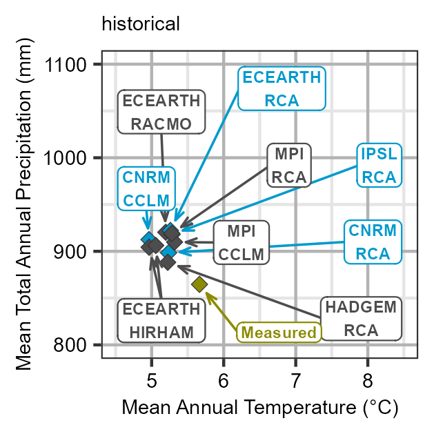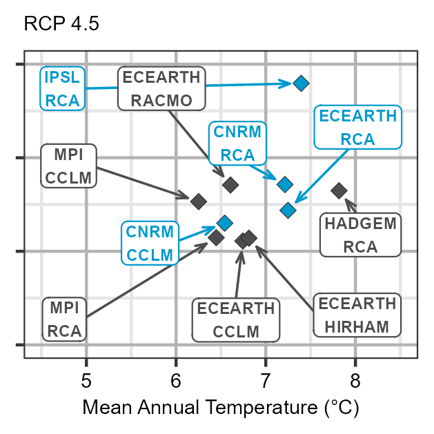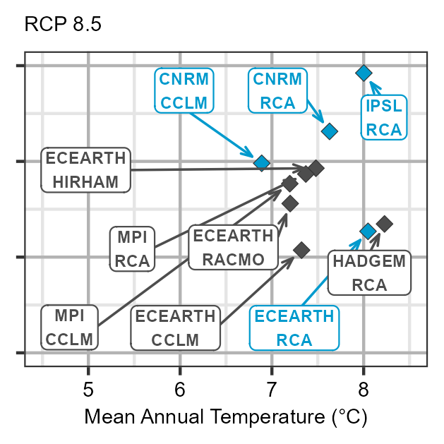

``` r

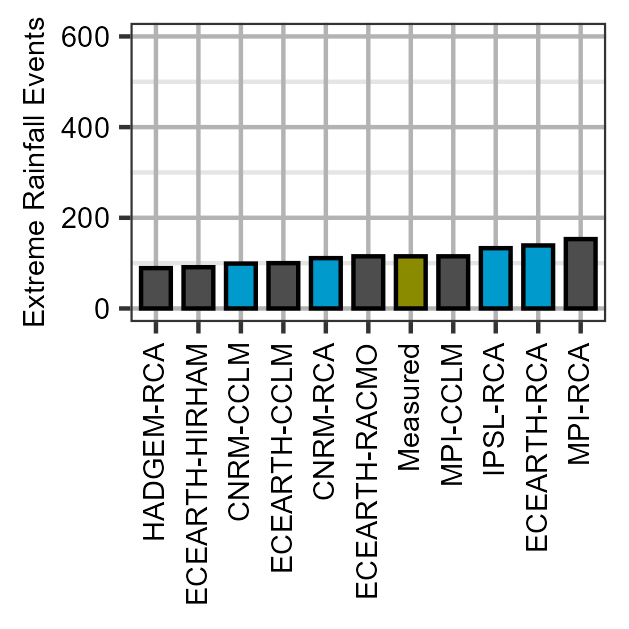
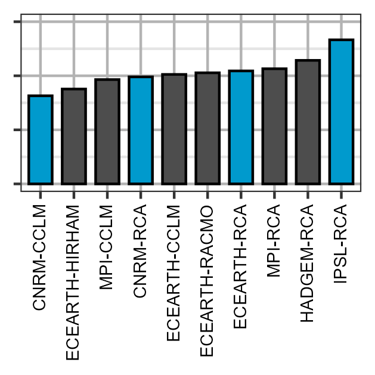
knitr::include_graphics("../man/figures/xtreme_rain_Aas_rcp85_71-05_41-70.png")
```

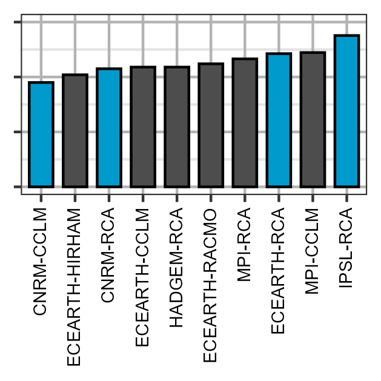

### Cleanup

``` r

file.remove("Climate_Data.zip")
#> [1] TRUE
unlink("Climate_Data/", recursive = T)
```
