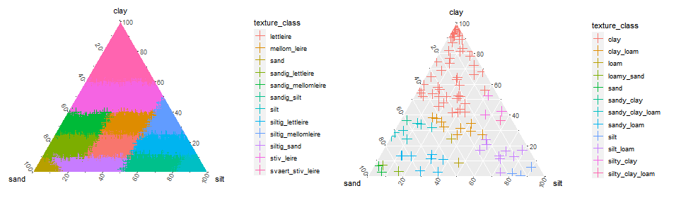

Author: Moritz Shore

Date: November, 2022

```{r, include = FALSE}
knitr::opts_chunk$set(
  collapse = TRUE,
  comment = "#>"
)
```

```{r setup, include=FALSE}
library(miljotools)
```

## Introduction

Classifies soils based off of clay, silt, sand fractions using USDA [@ditzler2017soil] or
Norwegian [@sveistrup1984kornstorrelsesgrupper] systems. 

```{r, fig1, echo= FALSE, fig.align='center', fig.cap="Figure 1: Soil classificatio based on the Norwegian (left) and USDA (right) systems.", out.width="100%", out.height="100%"}

```

The function has the following features:

-   Automatically Compatible with csv or xlsx. Tries to automatically
    guess format of data, and acts accordingly.

-   Automatically rounds total fraction to 100%, if differences are
    under 1%.

-   Exports classification based on user settings

-   Creates an interactive diagnostic plot, as well as saving one to
    output directory.

Note: the script will automatically try to identify which columns
contain the clay, silt, sand fractions and also try to identify which
format they are in. If this does not work, you might get incorrect or
flawed results, so make sure to **READ what THE CONSOLE prints out**, to
make sure it did the correct things. If the script cannot read your file
automatically, then the following format is recommended:

-   Clay column: "clay" in percent format (%), decimal = "."
-   Silt column: "silt" in format (%), decimal = "."
-   Sand column: "sand" in percent format (%), decimal = "."

## Usage

A simple usage is shown below. for a more in-depth run down of the
arguments please visit the function help page.

```{r, eval = F}

## CURRENTLY BROKEN BECAUSE OF ggtern DEPENDENCY ISSUE.


# for demonstration purposes, use path of package
example_file_path <- system.file(package = "miljotools", "/extdata/soil_classify/example.csv")

classify_soil(
  input = example_file_path,
  output = "output_file.csv",
  version = "NOR",
  plot_result = T,
  interactive = FALSE,
  decimal = ".",
  write = FALSE # false just for demonstration. 
)
```
## References
