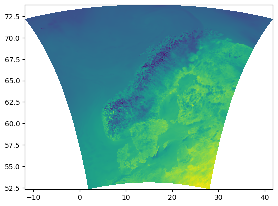
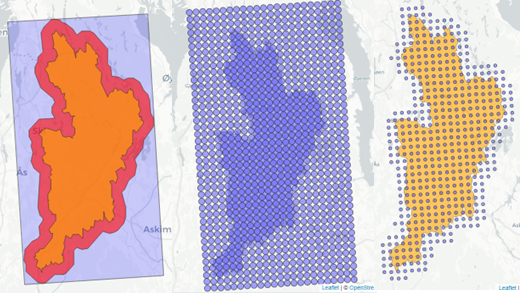

```{r setup, include=FALSE}
knitr::opts_chunk$set(echo = TRUE)
```

Author: Moritz Shore

Date: October, 2023

Last Update: October 29th, 2024

## Introduction

The MET Nordic Reanalysis Dataset is a reanalysis product from the
[Meteorologisk institutt](https://www.met.no/). You can read more about
the dataset
[here](https://github.com/metno/NWPdocs/wiki/MET-Nordic-dataset). The
MET Nordic rerun archive version 3 can be accessed using a dedicated
function in `miljotools`. Please inform yourself on the limitations of
reanalysis data before applying this dataset to your needs.

```{r, fig1, echo= FALSE, fig.align='center', fig.cap="Figure 1: The spatial domain of the reanalysis dataset.", out.width="50%", out.height="50%"}

```

### Specs

-   1x1 km grid covering the Nordics (see Figure 1.)

-   Hourly resolution from 2012-09-01 to 2023-01-31

-   Following variables: temperature, precipitation, relative humidity,
    wind speed, wind direction, air pressure, cloud area fraction,
    short+longwave radiation (downwelling), land area fraction, and
    altitude

## Usage

### Input

To access the data for a specific region of the Nordics, you need to
provide the following as input:

1.  A path to a geo-referenced
    [shapefile](https://doc.arcgis.com/en/arcgis-online/reference/shapefiles.htm)
    (single polygon or point) of the desired area

2.  A directory where you would like to save the data (default: working
    directory)

3.  A starting date and time

4.  An ending date and time

Optionally, you can pass additional parameters to buffer your shapefile,
choose your variables, resolution, to preview the data you are
downloading, or to download the files in NetCDF format. See the
[man-page](https://moritzshore.github.io/miljotools/reference/get_metno_reanalysis3.html)
for more information

#### Downloading Example Data

Downloading an example shape file from a public repository:

```{r}
download.file(url = "https://gitlab.nibio.no/moritzshore/example-files/-/raw/main/MetNoReanalysisV3/skuterud_shp.zip", destfile = "skuterud_shp.zip")
unzip("skuterud_shp.zip")
skuterud_shp = "skuterud_shp/skuterud_wb.shp"
```

Downloading two days with the default function:

```{r example, eval = TRUE}
download_folder <- get_metno_reanalysis3(
area = skuterud_shp,
fromdate = "2015-01-01 00:00:00",
todate = "2015-01-31 00:00:00", 
area_buffer = 1500,
preview = T
)
```

### Output

```{r, fig2, fig.align='center', fig.cap= "Figure 2. Processing the shapefile and downloading relevant grid points.", echo=FALSE, out.height="50%", out.width="50%"}

```

As output you will receive a separate .csv file for each grid point.
This .csv file contains the meteorological data as a timeseries, with a
column for each variable. Additionally one metadata file is created
listing the properties of each grid point (such as coordinates)

**Note:** Currently, this function must request the data from met.no
server on an hour-basis. This means that for each year to download, 8760
requests must be made to the server. This is rather slow, and as such
the download can take quite a few hours. We are working with met.no to
improve this situation.

### Conversion to Daily Data

If you would prefer to have your data in a daily format, you can use the
`reanalysis3_daily()` function. This function merely requires the path
of the download folder as created by `get_metno_reanalysis3()`. You can
pass a precision parameter which determines to which decimal point the
hourly data will be averaged / summed to.

```{r, eval = FALSE}
daily_data_path <-
  reanalysis3_daily(path = download_folder,
                    outpath = "C:/Users/mosh/Documents/met_no",
                    precision = 2)
```

### SWAT+ input generation from daily Reanalysis3 data

If you would like to generate SWAT+ meteo input from the daily data as
downloaded `get_metno_reanalysis3()` and converted from
`reanalysis3_daily()`, you can use the `reanalysis3_swatinput()`
function. This function, depending on the parameters given to it, will
generate your station files and weather generator. It also can update
your SWAT+ input files to match the new weather stations, or update your
`.sqlite` database. To do this, the function heavily utilizes
`SWATprepR` which needs to be installed before use. This can be done
[here](https://biopsichas.github.io/SWATprepR/).

```{r, eval=FALSE}
reanalysis3_swatinput(path = daily_data_path,
                      swat_setup = "C:/path/to/swat/txtinout")
```

### Reanalysis to SWAT+ input pipeline

The aforementioned three function can be linked together with the
`swat_weather_input_chain()`. It simply runs the three functions in
parallel, allowing you to generate and apply weather data to your SWAT+
project with one line of code.

```{r, eval = FALSE}
swat_weather_input_chain(
  area = "C:/Users/mosh/Documents/skuterud_wb.shp",
  swat_setup = "C:/path/to/swat/txtinout",
  directory = "path/to/working/directory",
  from = "2013-01-01 00:00:00",
  to = "2022-12-31 00:00:00"
)
```
