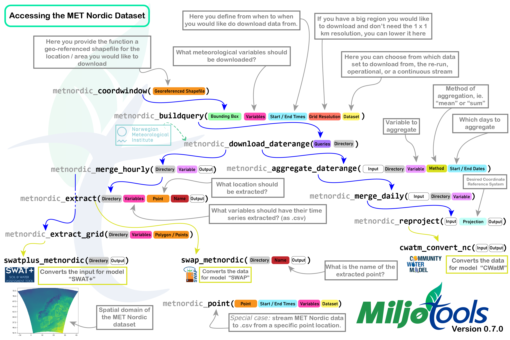

```{r setup, include=FALSE}
knitr::opts_chunk$set(echo = TRUE)
require(gifski)
```

[Author]{.underline}: Moritz Shore

[Date]{.underline}: October, 2023

[Last Update]{.underline}: March 15th, 2025

# Introduction

> Tip: check server status if issues with downloading exist:
> <https://status.met.no/>

The MET Nordic Reanalysis Data set is a reanalysis product from the
[Meteorologisk institutt](https://www.met.no/). You can [read more about
the data set
here](https://github.com/metno/NWPdocs/wiki/MET-Nordic-dataset). The MET
Nordic rerun archive and operational dataset can be accessed using
dedicated functions in `miljotools`. Please inform yourself on the
benefits and limitations of reanalysis data before applying this data
set to your needs.

```{r, fig1, echo= FALSE, fig.align='center', fig.cap="Figure 1: The spatial domain of the reanalysis dataset. (SOURCE: MET Nordic)", out.width="50%", out.height="50%"}
knitr::include_graphics("../man/figures/domain.png")
```

**Specs**

-   **1x1 km** grid covering the Nordics (see Figure 1.)

-   **Hourly** resolution from [2012-09-01]{.underline} to
    [TODAY]{.underline}

-   **Variables**: temperature, precipitation, relative humidity, wind
    speed, wind direction, air pressure, cloud area fraction,
    short+long-wave radiation (down-welling), land area fraction, and
    altitude.

**Input**

To access the data for a specific region of the Nordics, you need to
provide the following as input:

1.  A path to a georeferenced
    [shapefile](https://doc.arcgis.com/en/arcgis-online/reference/shapefiles.htm)
    of the desired area

2.  A directory where you would like to save the data (

3.  A starting date and time

4.  An ending date and time

Optionally, you can pass additional parameters to **buffer** your
shapefile, choose your **variables**, choose your **resolution**, or to
preview the data you are downloading.

# Overview

The following figure shows a flowchart of how the different functions
fit together, along with some explanation of the parameters.

```{r, fig2, echo= FALSE, fig.align='center', fig.cap="Figure 2: Overview of all the `metnordic` functions. You can download a full version of the image [here](https://gitlab.nibio.no/moritzshore/example-files/-/raw/main/MetNoReanalysisV3/metnordic_functions.png?inline=false)", out.width="100%", out.height="100%"}

```

The following will show you how to use these functions, but first the
required libraries need to be loaded for this example workflow:

```{r message=FALSE, warning=FALSE}
require(miljotools)
require(dplyr)
require(sf)
require(mapview)
require(readr)
require(raster)
library(terra)
library(tidyterra)
```

# Coordinate Window

To start, one needs to determine which grid cells of the dataset need to
be downloaded. this can be done with
[`metnordic_coordwindow()`](https://moritzshore.github.io/miljotools/reference/metnordic_coordwindow.html "link to documentation").
This function requires which requires us to pass a geo-referenced
shapefile of our area of interest.

The geometry of the shapefile can be either `polygon` or `point` , and
can either be the `path` to the file (including [sidecar
files](https://desktop.arcgis.com/en/arcmap/latest/manage-data/shapefiles/shapefile-file-extensions.htm))
or an `sf` object in the R environment. Here is an example:

> (By the way, these files are publicly available, so you can try this
> code yourself)

```{r message=FALSE, warning=FALSE}
# downloading example files:
download.file(url = "https://gitlab.nibio.no/moritzshore/example-files/-/raw/main/MetNoReanalysisV3/cs10point.zip", destfile = "cs10point.zip")
download.file(url = "https://gitlab.nibio.no/moritzshore/example-files/-/raw/main/MetNoReanalysisV3/cs10_basin.zip", destfile = "cs10_basin.zip")
unzip("cs10point.zip")
unzip("cs10_basin.zip")
cs10_basin = "cs10_basin/cs10_basin.shp"
cs10_point = "cs10point/cs10point.shp"
example_polygon_geometry <- read_sf(cs10_basin)
example_point_geometry <-  read_sf(cs10_point)
map1 <- mapview(example_polygon_geometry, alpha.regions = .3, legend = F)
map2 <- mapview(example_point_geometry, col.regions = "orange", legend = F)

map1+map2
```

Now, with our geometries loaded, we can create coordinate windows for
them. We will also buffer our polygon shapefile to ensure full coverage.

```{r}
coord_window_poly <- metnordic_coordwindow(example_polygon_geometry, area_buffer = 1500)
coord_window_point <- metnordic_coordwindow(example_point_geometry)
```

This gives us a list containing the minimum and maximum x and y cells to
download the data from. `metadist` is NA for polygon geometries.

```{r, results='hold'}
paste0(names(coord_window_poly), collapse = ", ")
paste0(coord_window_poly, collapse = ", ")
```

The `metadist` entry is only needed for point geometry and indicates the
distance to the nearest data set grid cell. Of course, for this geometry
there are only two coordinates:

```{r, results='hold'}
paste0(names(coord_window_point), collapse = ", ")
paste0(coord_window_point, collapse = ", ")
```

# Build Query

With our grid-cells set, we can build the queries that we would like to
download from the server. For that we also need to decide the following:

1.  `mn_variables` are the meteorological variables to be downloaded,
    these are [defined
    here](https://github.com/metno/NWPdocs/wiki/MET-Nordic-dataset#parameters "MET No Variables").
2.  `fromdate` and `todate` are time stamps for the period you would
    like to download. Make sure to follow the formatting requirements.
3.  `grid_resolution` is the resolution at which the area will be
    downloaded. For very large regions where a dense network of grid
    cells is not needed, this parameter can be used. A setting of `3`
    for example, will download data from every 3rd cell in the grid, in
    both x and y directions.
4.  `dataset` determines the data source. Classic would be setting this
    to "reanalysis", which is only the re-run archive, and covers
    approximately 2012-2022. The "operational" data set is also a
    reanalysis product, and covers the time period approximately between
    2018-TODAY. Probably the most useful setting is "continuous" which
    uses the re-run archive where ever possible, and then switches to
    the operational data set once the re-run ends. You can read more
    about this
    [here](https://github.com/metno/NWPdocs/wiki/MET-Nordic-dataset#available-data-streams "archive versions").

Determining our settings:

```{r}
my_variables = c("air_temperature_2m", "precipitation_amount")
start = "2019-06-01 00:00:00"
end = "2019-06-01 23:00:00"
```

```{r}
queries_poly <- metnordic_buildquery(bounding_coords = coord_window_poly,
                                mn_variables = my_variables,
                                fromdate = start, todate = end, 
                                grid_resolution = 1, dataset = "continuous")
```

And for point geometry:

```{r}
queries_point <- metnordic_buildquery(bounding_coords = coord_window_point,
                                mn_variables = my_variables,
                                fromdate = start, todate = end, 
                                grid_resolution = 1, dataset = "continuous")
```

We now have the files we want to download:

```{r}
queries_point$filenames %>% head()
```

And the `OPenDaP` download urls: (just one as an example, as they are
very long).

```{r}
queries_poly$full_urls[1]
```

> "metpparchivev3" indicates this comes from the re-run archive. if it
> were to say "metpparchive" only, that would indicate that it comes
> from the operational archive!

# Download

Now we are ready to download the files. Lets download 14:00 as it rained
at that time, a bit:

```{r}
poly_path <- "indiv_poly/"
dir.create(poly_path, showWarnings = F)
fps <- metnordic_download(url = queries_poly$full_urls[15],
                          outdir = poly_path,
                          vars = my_variables)
```

Please note, the downloaded files are separated per variable. Why?
Because the project this code was designed for needed the files like
that. Also, these files get very big very quickly, so having
per-variable separation can sometimes be useful.

## Download a Date Range

Now of course, you would like to download not just one file, but the
whole daterange, the following function allows you to do this.

```{r,  eval = FALSE}
dl_path = metnordic_download_daterange(
  queries = queries_poly,
  directory = poly_path,
  mn_variables = my_variables,
)

list.files(dl_path) %>% head()
```

## Downloading from Point Geometry

Please note! `metnordic_download()` and `metnordic_download_daterange()`
do not yet work for point geometries. As an alternative, you can use the
`metnordic_point()` function

```{r, eval = FALSE}
point_path <- "indiv_point/"
dir.create(point_path, showWarnings = F)
point_dl_path <- metnordic_point(
  area = example_point_geometry,
  path = point_path,
  fromdate = start,
  todate = end,
  mn_variables = my_variables,
  verbose = F
)

# Viewing the data:
data <- read_csv("indiv_point/METNORDIC_point.csv", show_col_types = F)
plot(data$date, data$air_temperature_2m-273.15,type = "b", ylab = "air_temperature_2m", xlab = "Timestamp", main = "metnordic_point() download")
```

# Merging Hourly Files

If you are working with hourly data, the next logical step would be to
merge the per-hour per-variable files into simply per-variable files.
You can do this like so:

```{r}
outpath = "merged_poly/"
dir.create(outpath, showWarnings = F)
merge_path = metnordic_merge_hourly(folderpath = poly_path,
                                    variable = "air_temperature_2m",
                                    outpath = outpath)
```

```{r gif, fig.align='center', fig.cap="Hourly Air Temperature in K", message=FALSE, warning=FALSE, animation.hook='gifski', interval=0.2, echo=TRUE}
data <- brick(merge_path)
spatast <- data  %>% rast()
hours = dim(data)[3]
for (i in c(1:hours)) {
  plot(spatast[[i]], legend = FALSE, main = spatast[[i]] %>% names())
}
```

# Extracting Timeseries

In most cases, one would want a time series from a point on this map,
`metnordic_extract()` does exactly this.

```{r}
dir.create("extracted", showWarnings = F)
metnordic_extract(
  directory = "merged_poly",
  mn_variables = "air_temperature_2m",
  point = example_point_geometry,
  outdir = "extracted",
  name = "vignette_example",
  verbose = T
)
```

```{r}
# Viewing the data:
data <- read_csv("extracted//METNORDIC_point_vignette_example.csv", show_col_types = F)
plot(data$date, data$air_temperature_2m-273.15,type = "b", ylab = "air_temperature_2m", xlab = "Timestamp", main = "metnordic_extract() data")
```

# Further processing the data cube

## Aggregating

In some cases you might not want to extract single points and would like
to keep working with the NetCDF4 data cube. If you would like to have
the data in daily form, you can aggregate it (summarize) using
`metnordic_aggregate()`:

```{r}
dir.create("aggregated/", showWarnings = F)
agg_path <- metnordic_aggregate(directory = "indiv_poly/", 
                                variable = "air_temperature_2m",
                                method = "mean",
                                day =  "20190601",
                                outpath = "aggregated/",
                                verbose = F, overwrite = T)
```

```{r message=FALSE, warning=FALSE}
data <- brick(agg_path)
spatast <- data  %>% rast()
plot(spatast, main = "air_temperature_2m_mean (2019-06-01)")
```

Now that was only a single day, and usually you would like to aggregate
very many days all at once. A dedicated function for this does not exist
yet, but you can easily write a for loop (or better yet – parallelize
it). I have written such code, if you would like to see it as an example
feel free to contact me. Someday it will be in the package.

```{r}
# TODO: add `metnordic_aggregate_daterange()` to package. 
```

## Merging

Now we would usually merge the aggregated days together, with
miljotools, like so:

> Tip: don't forget to add the method of aggregation as a suffix!

```{r}
# TODO download two days instead of one so that this makes more sense
dir.create("merged_daily/")
merged_fp <- metnordic_merge_daily(folderpath = "aggregated/",
                                   variable = "air_temperature_2m_mean",
                                   outpath = "merged_daily/",overwrite = T)
```

## Re-projecting

If your use-case requires your NetCDF file to be in a specific
projection, you can re-project it like so:

```{r}
metnordic_reproject(filepath = merged_fp,
                    outfile = "reprojected_example.nc",
                    projstring = "+proj=utm +zone=33 +datum=WGS84 +units=m +no_defs +type=crs")
```

```{r message=FALSE, warning=FALSE}
reproj <- rast("reprojected_example.nc")
mapview(reproj)
```

# Link to Other Models

So far, conversion of MET Nordic data, as downloaded by `miljotools`,
has been implemented for three models, in order of implementation:
[SWAT+](https://swat.tamu.edu/software/plus/),
[CWatM](https://cwatm.iiasa.ac.at/), and
[SWAP](https://www.swap.alterra.nl/). Here is how it works:

## SWAT+

```{r}
# TODO
```

## CWatM

CWatM takes in NetCDF files, We take the file as projected by
`metnordic_reproject()` into the correct projection for the setup. Note,
this needs to be done per variable.

```{r}
cwatm_convert_nc(infile = "reprojected_example.nc", outfile = "cwatm_ready.nc")
```

## SWAP

SWAP, being a field scale model, needs point data. Therefore we convert
from the `metnordic_extract()` function.

```{r}
# TODO, download all SWAP variables to get this to work
swap_metnordic(
  dldir = "extracted/",
  name = "vignette_example",
  outpath = "metnordic.met",
  timescale = "daily",
  verbose = T
)
```
