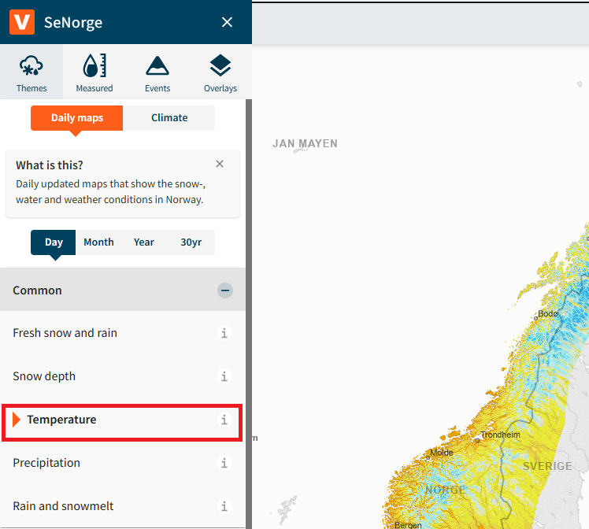
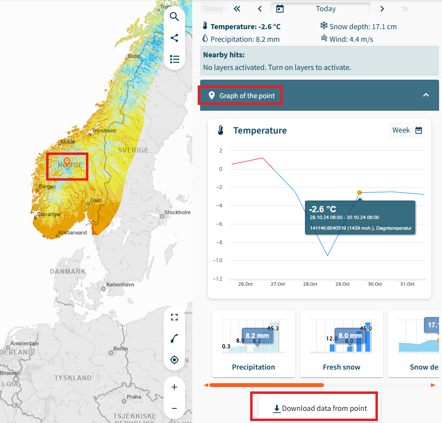
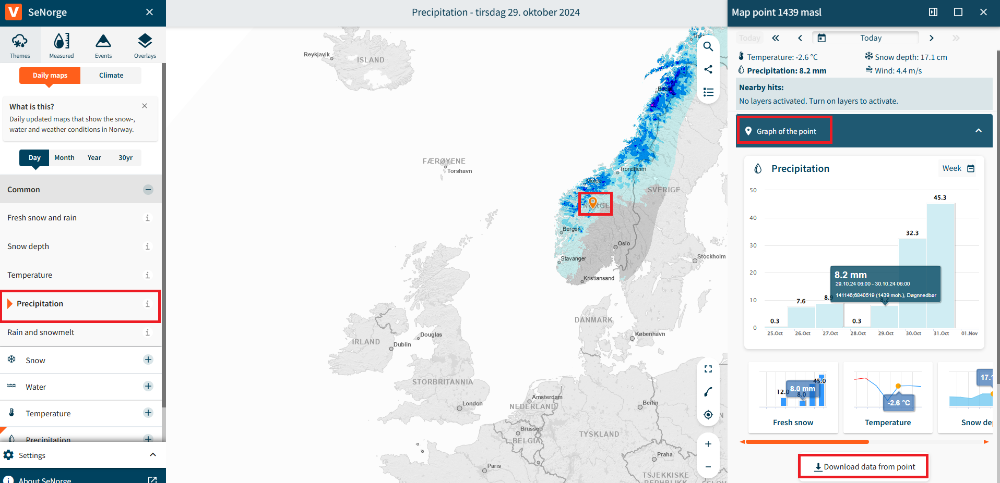

Author: Moritz Shore Date: 01.06.2022

```{r, include = FALSE}
knitr::opts_chunk$set(
  collapse = TRUE,
  comment = "#>"
)
```

```{r setup, include=FALSE}
library(miljotools)
```

## Introduction

This tutorial will show you how to create Thermopluviograms and Extreme
rainfall plots using climate data from the Norwegian climate service and
observed data from SeNorge. To get started, we will grab data from
SeNorge.

### SeNorge

1.  Go to [senorge.no](https://www.senorge.no/), from the side menu,
    select themes \> daily maps \> temperature

```{r, fig1, echo= FALSE, fig.align='center', out.width="100%", out.height="100%"}

```

2.  Select the point on interest on the map, then select "Graph of the
    point" and then download data from the point

```{r, fig2, echo= FALSE, fig.align='center', out.width="100%", out.height="100%"}

```

3.  Perform the same for Precipitation:

```{r, fig3, echo= FALSE, fig.align='center', out.width="100%", out.height="100%"}

```

That concludes the data acquisition part from SeNorge. Of course, you
can source your observed data from where ever you please and use it in
stead of SeNorge, if you match the format.

### NVE

Our climate data will be sourced from NVE's Klima service cente

1.  Go to <https://nedlasting.nve.no/klimadata/kss> (DEPRECATED)

2.  Nevermind, that has been discontinued, instead go here:
    <https://thredds.met.no/thredds/catalog/KSS/Klima_i_Norge_2100/utgave2015/catalog.html>

3.  It seems like getting this data has become a lot harder now, and
    perhaps needs a re-anylsis v3 type solutions.. for now the tutorial
    will continue with our example data, and it is up to you to manage
    the download for your location (for now).

## Workflow

For this example, we will download example data from a GitLab Repo:

```{r downloadgitlab}
download.file(url = "https://gitlab.nibio.no/moritzshore/example-files/-/raw/main/thermopluviograms/Climate_Data.zip", 
              destfile = "C:/Users/mosh/Downloads/Climate_Data.zip")
unzip("C:/Users/mosh/Downloads/Climate_Data.zip", 
      exdir = "C:/Users/mosh/Downloads")
dir.create("C:/Users/mosh/Documents/plots", showWarnings = F)
```

Now we can generate the Thermopluviograms

```{r thermopluvio}
thermopluviogram(
  modelled_climate = "C:/Users/mosh/Downloads/Climate_Data/Modelled/",
  observed_pr = "C:/Users/mosh/Downloads/Climate_Data/Observed/senorge_pr.csv",
  observed_tm = "C:/users/mosh/Downloads/Climate_Data/Observed/senorge_temp.csv",
  outpath = "C:/Users/mosh/Documents/plots",
  location = "Aas",
  chosen_model_runs = c("CNRM-CCLM", "CNRM-RCA", "ECEARTH-RCA", "IPSL-RCA"),
  ref_startdate = "1971-01-01",
  ref_enddate = "2005-12-31",
  obs_startdate = "2041-01-01",
  obs_enddate = "2070-12-31",
  left_yaxis_only = T,
  fixed_axis = T,
  verbose = T
)
```

### Plots

```{r, fig4, fig.show="hold", out.width="30%"}
knitr::include_graphics("c:/Users/mosh/Documents/plots/tpg_Aas_hist_71-05_41-70.png")
knitr::include_graphics("c:/Users/mosh/Documents/plots/tpg_Aas_rcp45_71-05_41-70.png")
knitr::include_graphics("c:/Users/mosh/Documents/plots/tpg_Aas_rcp85_71-05_41-70.png")
```

```{r, fig5, fig.show="hold", out.width="30%"}
knitr::include_graphics("c:/Users/mosh/Documents/plots/xtreme_rain_Aas_hist_71-05_41-70.png")
knitr::include_graphics("c:/Users/mosh/Documents/plots/xtreme_rain_Aas_rcp45_71-05_41-70.png")
knitr::include_graphics("c:/Users/mosh/Documents/plots/xtreme_rain_Aas_rcp85_71-05_41-70.png")
```

### Cleanup

```{r cleanup}
file.remove("C:/Users/mosh/Downloads/Climate_Data.zip")
unlink("C:/Users/mosh/Downloads/Climate_Data/", recursive = T)
```
